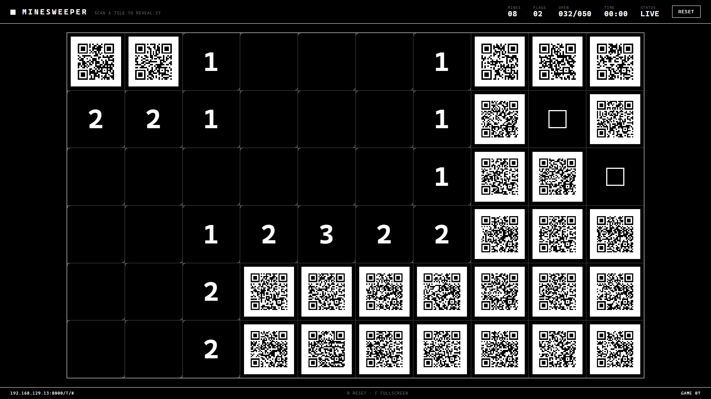
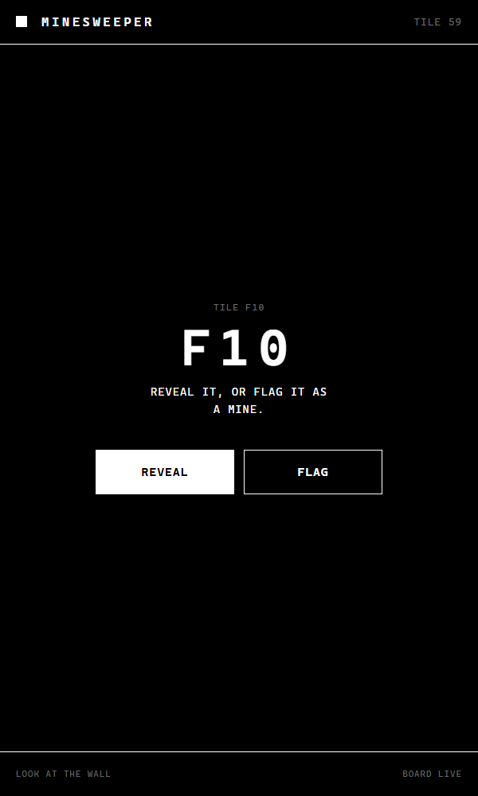

# QR Minesweeper

Minesweeper for a wall. The board is projected; every hidden tile is a QR code.
Scan a tile with your phone, choose REVEAL or FLAG, and it happens on the wall.



<p align="center">
  
</p>

## Original prompt

The whole thing was built from this one prompt:

> use a pythonn server nad plain js+css. Make like a grid of QR codes, then when
> you scan it it sends something to the server so it unlocks that tile, thats
> how you play minesweeper, it willbe projected on a giant wall. styling is
> black and white and minimalistic, like marathon!!

Followed by one change request: instead of revealing on scan, the phone should
let you choose REVEAL or FLAG, since the PC driving the projector is hidden.

## Run

```
pip install -r requirements.txt
python server.py
```

Open `http://localhost:8000/` on the projector machine and press `F` for fullscreen.
Phones must be on the same network as the server. The QR codes encode the
machine's LAN address, which is auto-detected. Override it if the guess is wrong:

```
python server.py --host 192.168.1.20
python server.py --base-url http://mines.local:8000
```

Board size and difficulty:

```
python server.py --cols 12 --rows 7 --mines 14
```

## Rules

- Scanning a hidden tile opens a page on the phone with two buttons: REVEAL or FLAG.
- The first reveal of a round is always safe.
- Zero tiles flood open their neighbours, as usual.
- A mine ends the round. Revealing every safe tile wins it.
- After a round, the phone page offers a NEW GAME button. On the projector, `R`
  resets a finished board and `Shift+R` resets at any time.

## Stack

- `server.py`: Python standard library `http.server`, plus the `qrcode` package
  for the QR SVGs. Holds the game state and serves the JSON API.
- `static/index.html`, `style.css`, `app.js`: the projector view. Plain JS,
  polls the board state a few times per second.
- `static/tile.html`, `tile.js`: the phone page a QR code opens.

## Endpoints

| Route                   | Purpose                                   |
| ----------------------- | ----------------------------------------- |
| `GET /`                 | projector board                           |
| `GET /t/<id>`           | phone page (what the QR encodes)          |
| `GET /qr/<id>.svg`      | QR code for a tile                        |
| `GET /api/tile/<id>`    | one tile's state (used by the phone page) |
| `GET /api/state`        | board state (polled by the projector)     |
| `POST /api/reveal/<id>` | reveal a tile                             |
| `POST /api/flag/<id>`   | toggle a flag                             |
| `POST /api/reset`       | new round                                 |
